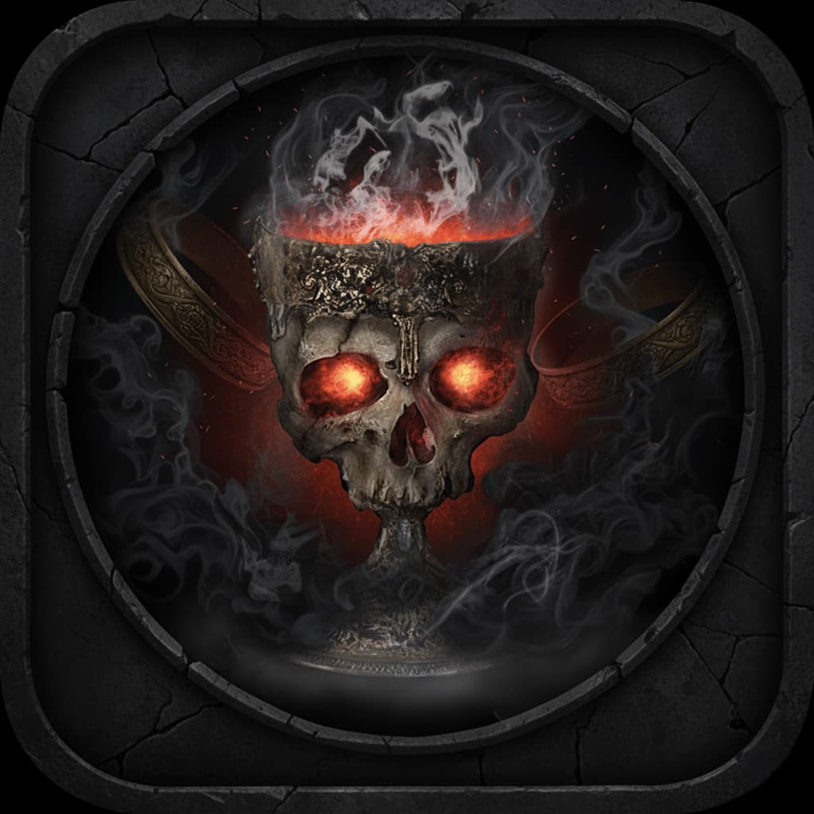
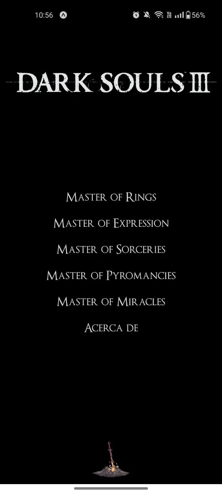
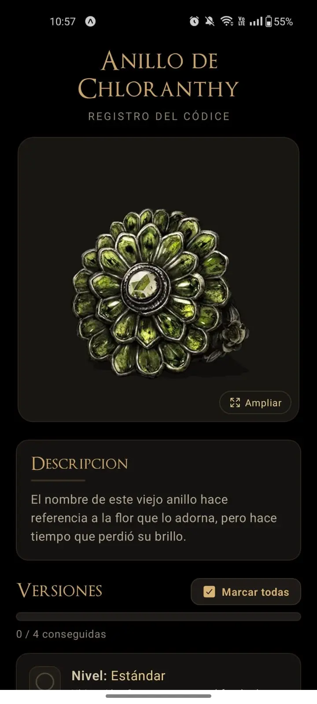

# Ashen Codex: Dark Souls 3 Tracker

> Un compendio móvil para los Latentes que buscan completar su arduo viaje por el reino de Lothric.


**Ashen Codex** es una aplicación móvil, no oficial, desarrollada por un fan y para fans de la saga Souls. Su objetivo es servir como una guía y herramienta de seguimiento para ayudar a los jugadores de Dark Souls 3 a encontrar todos los objetos coleccionables del juego, desde anillos y gestos hasta hechizos y piromancias.

<p align="center">
  
</p>

---

## Características Principales

- **Seguimiento de Progreso Detallado:** Marca cada objeto que encuentres. La app guarda tu progreso localmente en el dispositivo.
- **Múltiples Categorías:** Registra tu avance en Anillos, Gestos, y más categorías.
- **Filtro Inteligente:** Filtra fácilmente los objetos por su estado: **Completado**, **En Progreso** o **No Iniciado**.
- **Interfaz Temática:** Diseñada con una estética inspirada en la oscura y melancólica atmósfera de Dark Souls 3 para una experiencia inmersiva.
- **Información Detallada:** Cada objeto cuenta con su descripción, ubicación y otros detalles relevantes extraídos de las mejores fuentes de la comunidad.
- **Fluidez y Optimización:** Desarrollada con un enfoque en el rendimiento para garantizar una experiencia de usuario suave y agradable.

---

## Capturas de Pantalla

<table>
  <tr>
    <td align="center">
      <p><strong>Pantalla de Inicio</strong></p>
      
      </td>
    <td align="center">
      <p><strong>Lista de Ítems</strong></p>
      
      </td>
    <td align="center">
      <p><strong>Detalle del Ítem</strong></p>
      
      </td>
  </tr>
</table>

---

## Tecnologías Utilizadas

Este proyecto fue construido utilizando tecnologías modernas para el desarrollo móvil.

**Stack Principal:**


**Librerías y Herramientas:**

- **Navegación:** `React Navigation (Native Stack)` para transiciones fluidas y nativas.
- **Gestión de Estado:** `React Hooks` (useState, useCallback, useMemo, useEffect) y hooks personalizados para una lógica encapsulada y eficiente.
- **Almacenamiento Local:** `AsyncStorage` para persistir el progreso del usuario en el dispositivo.
- **Iconografía:** `@expo/vector-icons` para los íconos de la interfaz.

---

## Cómo Empezar

Sigue estos pasos para ejecutar una copia local del proyecto.

### Prerrequisitos

Asegúrate de tener instalado Node.js (LTS recomendado) y npm en tu sistema.

- [Node.js](https://nodejs.org/)
- Un dispositivo físico con la app **Expo Go** o un emulador de Android/iOS.

### Instalación

1.  **Clona el repositorio:**

    ```sh
     git clone https://github.com/NelmerStgo/Dark-Souls-3-App.git
    ```

2.  **Navega al directorio del proyecto:**

    ```sh
    cd Dark-Souls-3-App
    ```

3.  **Instala las dependencias:**

    ```sh
    npm install
    ```

4.  **Inicia el servidor de desarrollo de Expo:**

    ```sh
    npx expo start
    ```

5.  Escanea el código QR con la aplicación **Expo Go** en tu teléfono para abrir la app.

---

## Estructura del Repositorio

El proyecto está organizado de una manera modular para facilitar el mantenimiento y la escalabilidad.

```
/
├── assets/         # Fuentes e imágenes.
├── components/     # Componentes de UI reutilizables (ListItem, botones, modales).
├── data/           # Archivos JSON con la información del juego.
├── hooks/          # Hooks personalizados.
├── navigation/     # Configuración de React Navigation (stacks, tabs).
├── screens/        # Componentes que representan una pantalla completa.
└── theme/          # Archivo centralizado para colores y estilos globales.
```

---

## Roadmap (Planes a Futuro)

- [ ] Implementar una barra de búsqueda para encontrar ítems rápidamente.
- [ ] Añadir una sección para el seguimiento de los logros/trofeos.
- [ ] Explorar temas de personalización de la UI (ej. tema claro "Luz Solar").

---

## Agradecimientos y Fuentes de información

Este proyecto no sería posible sin la increíble comunidad de Dark Souls que ha documentado cada secreto del juego. La información contenida en esta app ha sido recopilada principalmente de:

- [Dark Souls Wiki (Fandom)](https://darksouls.fandom.com/es/wiki/Wiki_Dark_Souls)
- [Elite Guías](https://www.eliteguias.com/guias/d/dksl3/dark-souls-iii.php)

---

## Licencia

Este proyecto se distribuye bajo la Licencia MIT. Consulta el archivo `LICENSE` para más detalles.

---

## Aviso Legal

Esta es una aplicación no oficial creada por un fan y para fans. No está afiliada, asociada, autorizada, respaldada por, ni de ninguna manera oficialmente conectada con **FromSoftware, Inc.**, **Bandai Namco Entertainment Inc.**, o cualquiera de sus subsidiarias o afiliadas.

"Dark Souls" y todas las marcas, imágenes y nombres relacionados son propiedad intelectual de sus respectivos dueños.

---

<p align="center">
  <i>"Que las brasas guíen tu camino, Latente."</i>
</p>
